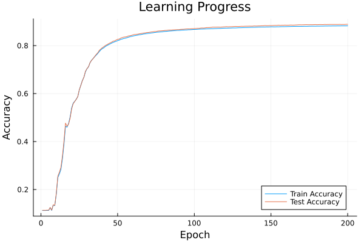

# Feedback Alignment for MNIST Classification

This project implements a neural network trained on the MNIST dataset using the Feedback Alignment (FA) algorithm instead of traditional backpropagation. The primary goal of this implementation is to provide a clear and understandable example of how the Feedback Alignment algorithm works, as described in the paper ["Random feedback weights support learning in deep neural networks"](https://arxiv.org/abs/1411.0247) by Lillicrap et al. (2016).

## Overview

This code is designed as an educational tool to clarify the Feedback Alignment algorithm, rather than as a high-performance or state-of-the-art implementation. It prioritizes readability and simplicity over speed or achieving the best possible accuracy.

The implementation trains a 3-layer neural network (784 -> 64 -> 32 -> 10) on the MNIST dataset using Feedback Alignment. This algorithm replaces the transpose of the weight matrices in backpropagation with fixed random matrices, demonstrating that precise weight transport is not necessary for effective learning in neural networks.

## Libraries Used

This implementation uses the following Julia libraries which will need to be installed to run the code: MLDatasets, OneHotArrays, LinearAlgebra, Random, ProgressMeter, Plots

## Results

The graph above shows the training progress over 100 epochs:

- Train Accuracy: The accuracy of the model on the training set
- Test Accuracy: The accuracy of the model on the test set
- Train Loss: The loss (cross-entropy) on the training set

As we can see, both train and test accuracies improve over time, while the training loss decreases, indicating that the model is learning effectively using Feedback Alignment.

## Code Description

The main components of the code are:

1. Data Preparation: Load and preprocess the MNIST dataset.
2. Network Initialization: Initialize the weights and feedback alignment matrices.
3. Training Loop:
   - Forward pass through the network
   - Error calculation
   - Backward pass using feedback alignment matrices
   - Weight updates
4. Evaluation: Calculate and store training accuracy, test accuracy, and training loss for each epoch.
5. Visualization: Plot the learning progress over time.

Each of these steps is implemented with clarity as the primary goal, allowing readers to easily follow the Feedback Alignment algorithm's process.

## Conclusion

This implementation serves as an educational tool to demonstrate that Feedback Alignment can be used as an effective alternative to backpropagation for training neural networks. By prioritizing clarity over performance, it aims to help readers understand the core concepts of the algorithm as presented in the original paper.

The results show that the network successfully learns to classify MNIST digits, achieving good accuracy on both training and test sets, despite using fixed random matrices for error propagation instead of the transposed weight matrices used in standard backpropagation.
